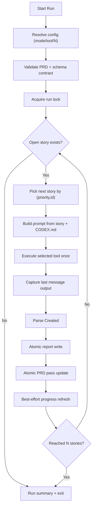

# Ralph Loop Flow

This flow documents the deterministic per-story runner contract implemented in `ralph.sh`.

## Invariants

- Exactly one story is processed per loop iteration.
- Exactly one tool execution happens per story.
- Report write and PRD mutation are both atomic.
- `fixing` mode enforces scope based on pre/post worktree state.
- Locking prevents concurrent writers on `prd.json`.
